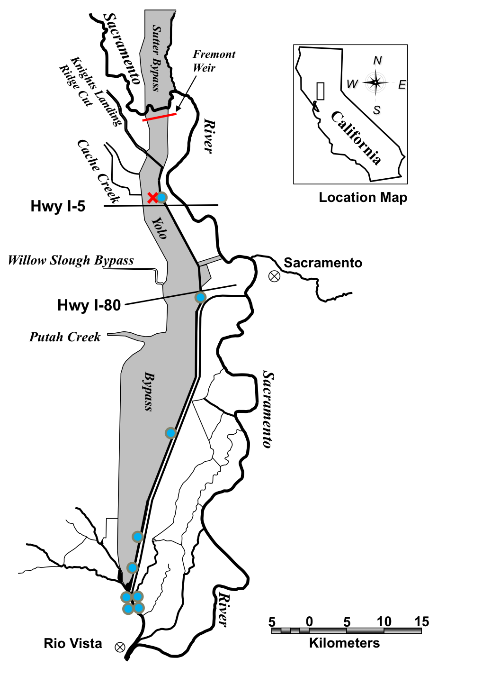
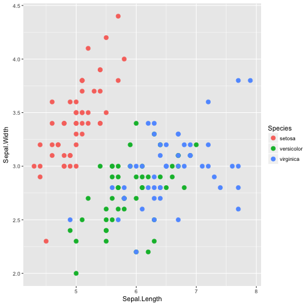

## Things that go into a slideshow

> - Title slide with affiliation and logo
> - Outline Slide with animated bullets
> - Intro slide with a picture
> - Methods slide with a diagram
> - Results slide with a graph

## Intro slide with horizontal picture

## Methods slide with a diagram

  Acoustic telemetry array in the Yolo Bypass
  
   

## Methods slide with a diagram

Acoustic telemetry array in the Yolo Bypass

## Results Slide With a Plot

